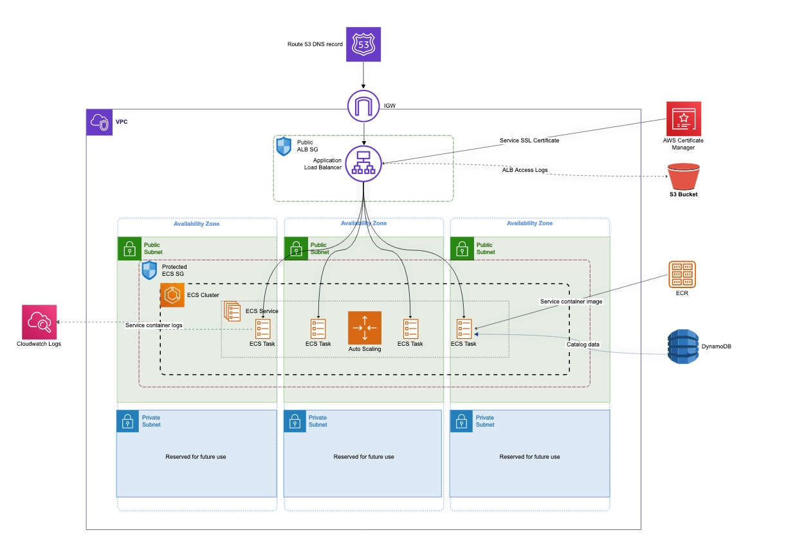

# Catalog API Infrastructure (Protected)
This is a Terraform project to manage the infrastructure for a [demo catalog API.](https://github.com/animaldna/catalog-api)

This version runs ECS from public subnets and relies on an ALB + security groups to control access. It's less secure, but cheaper than running a [NAT gateway](https://docs.aws.amazon.com/vpc/latest/userguide/vpc-nat-gateway.html) (or NAT instance).

The private version is [available in this repo.]() Be aware of [NAT gateway pricing](https://aws.amazon.com/vpc/pricing/) before launching.



## Additional Info
This infrastructure isn't fully managed by Terraform. Managing backend config resources (S3 + DynamoDB) in the same TF project proved problematic, so those were created manually and are passed to TF.

The Route 53 hosted zone was also created outside of Terraform. Most domains are already registered and setup when a new service is created, as was the case with mine.

**This project is meant to manage infrastructure only, NOT deployment.** The `image` variable is technically meant to be a placeholder, although you could use whatever you want. A deploy script handles task definition updates outside of Terraform. [You can read more about this setup here.]()

## Requirements
- Terraform v1.1.2
- S3 bucket to store state files
- DynamoDB table for state locking
- Appropriate IAM permissions
- Route 53 hosted zone
- Certificate Manager SSL cert for domain (temporary)

## Usage
Create a backend config file:
```
bucket         = "your-state-bucket"
key            = "your-key-here/terraform.tfstate"
region         = "your-aws-region"
encrypt        = true||false
dynamodb_table = "your-state-lock-table-name"
```

Initialize Terraform with your backend config and variables. I use a saved .tfvars file when working locally and a dynamically generated file when running from a CI pipeline.

```sh
terraform init -backend-config="dev.s3.tfbackend" -var-file="dev.tfvars"
```

Validate your project:

```sh
terraform validate
```

Apply (or plan if you'd like to review first):
```sh
terraform apply|plan -var-file="dev.tfvars"
```

## TODOs
- [x] Container logging (ecs)
- [x] Auto scaling
- [ ] Load testing
- [ ] Dynamic ports (ecs)
- [ ] Dynamic ACM cert
- [ ] Add safe IPs to SGs for SSH access (sgs)
- [ ] Restrict ECS roles (iam)
- [ ] Get NACL template working (vpc)
- [ ] Sort out separation of environments and state management
- [ ] Deploy script

Articles of note: 
- [Terraform Dynamic Subnets](https://medium.com/prodopsio/terraform-aws-dynamic-subnets-455619dd1977)
- [Terraform cidrsubnet function](https://www.terraform.io/language/functions/cidrsubnet)
- [Terraform cidrsubnet deconstructed](http://blog.itsjustcode.net/blog/2017/11/18/terraform-cidrsubnet-deconstructed/)

## Author
Chloe Boylan

## License
Copyright © 2021 Chloe Boylan.
This project is MIT licensed.
