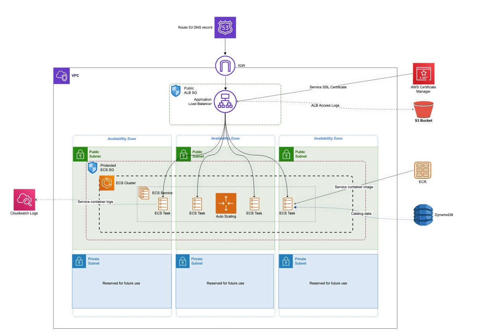
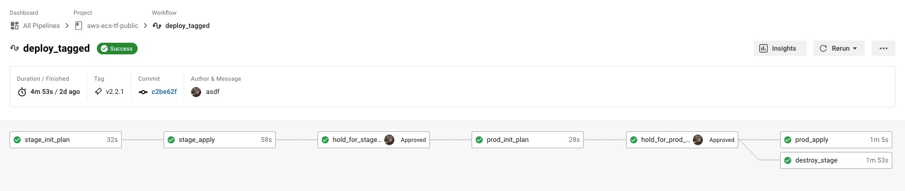
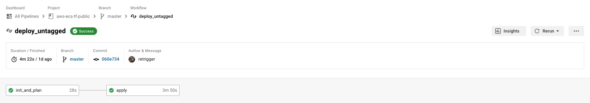

[](https://circleci.com/gh/animaldna/aws-ecs-tf-public/tree/master) [](https://github.com/animaldna/catalog-api-tf-public/commits/master)


# API Infrastructure - ECS & Terraform
This project manages the infrastructure for a [demo catalog API](https://github.com/animaldna/catalog-api) with Terraform.

This version runs ECS from public subnets and relies on an ALB + security groups to control access. It's less secure, but cheaper than running a [NAT gateway](https://docs.aws.amazon.com/vpc/latest/userguide/vpc-nat-gateway.html) (or NAT instance).

<!-- The private version is [available in this repo ]()(coming soon).-->



## Additional Info
This setup isn't *fully* managed by Terraform. Managing backend config resources (S3 + DynamoDB) in the same TF project proved problematic, so those were created manually and are passed to TF. The Route 53 hosted zone was also created outside of Terraform.

**This project is meant to manage infrastructure only, NOT application deployment.** 

The `image` variable is technically meant to be a placeholder, as deployments are handled outside of Terraform in the app's [CircleCI pipeline.](https://github.com/animaldna/catalog-api/blob/master/.circleci/config.yml) <!--[You can read more about this setup here ]()(coming soon).--> The default right now is a public sleep container. Pass something meaningful when launching, otherwise you'll get 503 errors from the load balancer.


## CI/CD Pipeline
There are two workflows in the CircleCI pipeline currently. `deploy_tagged` deploys tagged commits only and includes a full stage build and approval process. 



`deploy_untagged` skips the stage build and requires no approvals.



## Requirements
- Terraform v1.1.2
- S3 bucket to store state files
- DynamoDB table for state locking
- Appropriate IAM permissions
- Route 53 hosted zone
- Certificate Manager SSL cert for domain (temporary)

## Usage
Update the backend config file(s) in [backends/](/backends) to use your own resource names and options.
```
bucket         = "your-state-bucket"
key            = "your-key-here/terraform.tfstate"
region         = "your-aws-region"
encrypt        = true||false
dynamodb_table = "your-state-lock-table-name"
```

Initialize Terraform with a backend config and variables. I use .tfvars files when working locally and var flags when running from a CI pipeline.

```sh
terraform init -backend-config="dev.s3.tfbackend" -var-file="dev.tfvars"
```

Validate your project:

```sh
terraform validate
```

Apply (or plan if you'd like to review first):
```sh
terraform apply|plan -var-file="dev.tfvars"
```

To destroy resources:
```sh
terraform destroy -var-file"dev.tfvars"
```

## Known Issues
- Inconsistent plan errors on first apply (only on dev?). AWS provider issue, see [#19583](https://github.com/hashicorp/terraform-provider-aws/issues/19583). Current workaround to simply reapply.

## TODOs
### CircleCI
- [x] Conditional CircleCI jobs - don't need stage env for small changes
- [ ] Pull last stable image to use in task def for stage builds
- [ ] Slack approvals
- [ ] Slack notifications for build fail/success
- [ ] Add tflint job
- [x] Add CI workflow diagram
- [ ] Fix issue with using dev context
- [ ] Optional job for stage branch only
- [ ] Optional job for dev branch only

### Terraform
- [x] Container logging (ecs)
- [x] Auto scaling
- [x] Sort out separation of environments and state management
- [ ] Switch to private sub + VPC endpoints
- [ ] Load testing
- [ ] Dynamic ports (ecs)
- [ ] Dynamic ACM cert
- [ ] Add safe IPs to SGs for SSH access (sgs)
- [ ] Restrict ECS roles (iam)
- [ ] NACL template (vpc)

**Articles of note:**
- [Terraform Dynamic Subnets](https://medium.com/prodopsio/terraform-aws-dynamic-subnets-455619dd1977)
- [Terraform cidrsubnet function](https://www.terraform.io/language/functions/cidrsubnet)
- [Terraform cidrsubnet deconstructed](http://blog.itsjustcode.net/blog/2017/11/18/terraform-cidrsubnet-deconstructed/)

**Things I might eventually test:**
- Maybe replace destroy checkout with more specific persistence
- Save tfplans to S3

## Author
Chloe Boylan

## License
Copyright © 2021 Chloe Boylan.
This project is MIT licensed.
